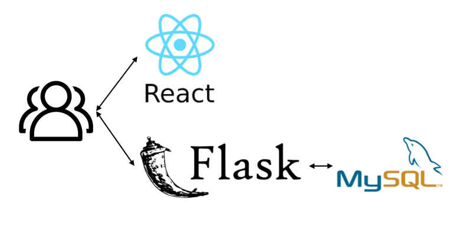
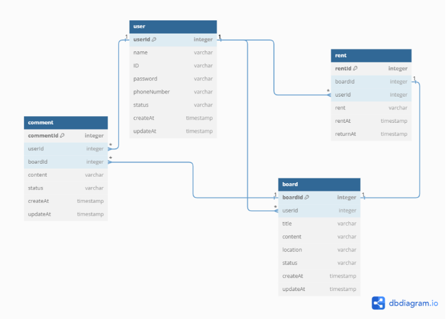
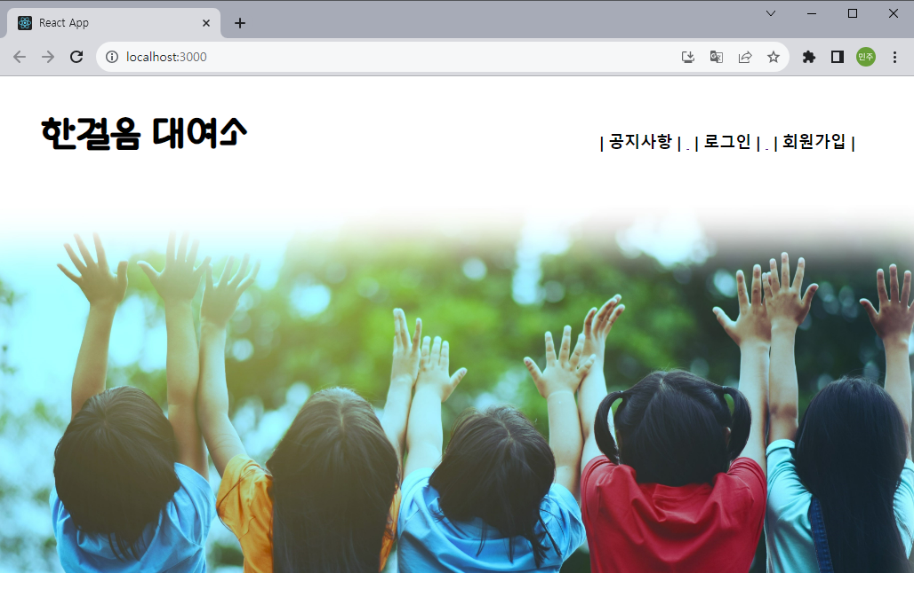
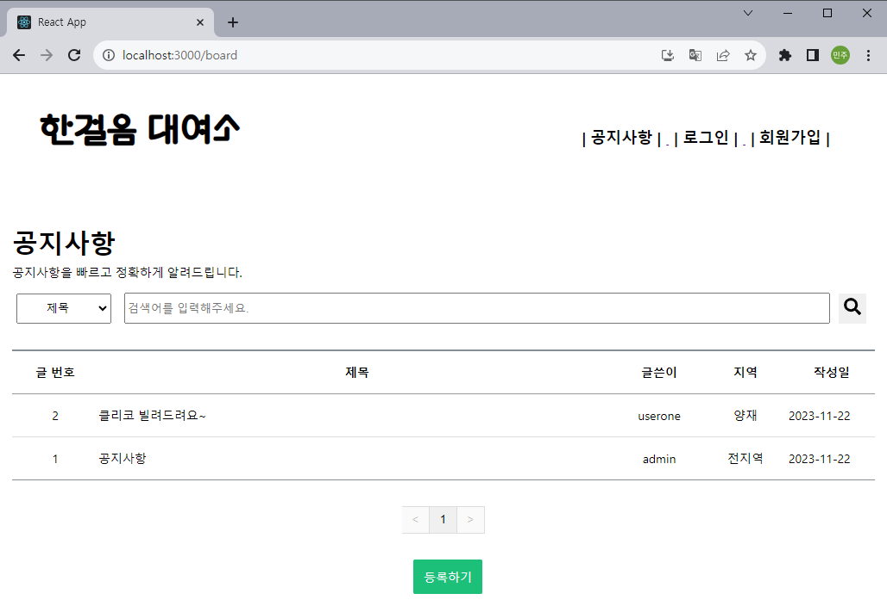
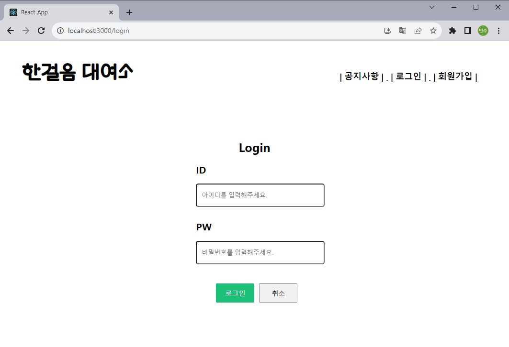
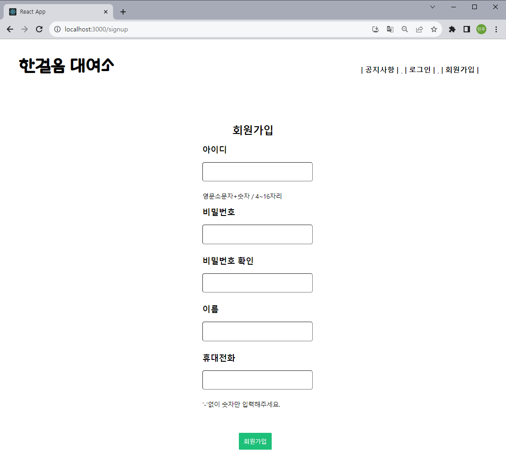
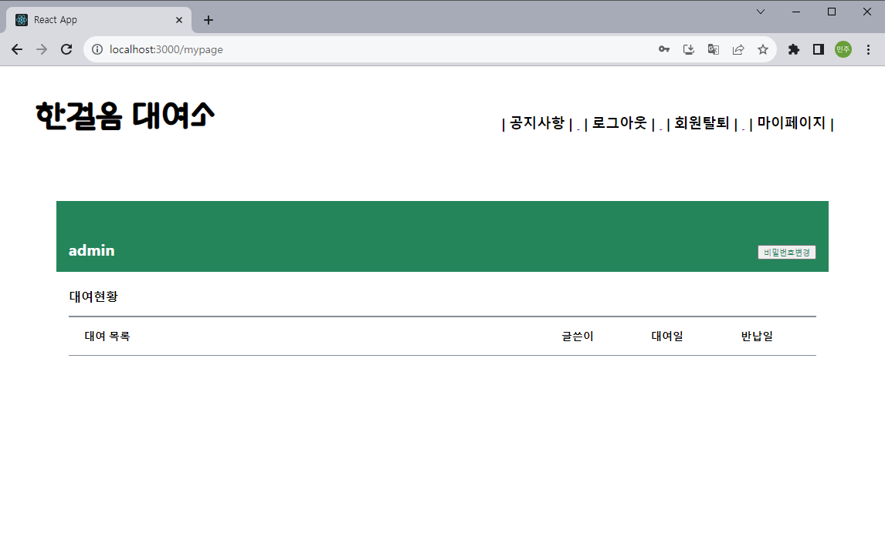
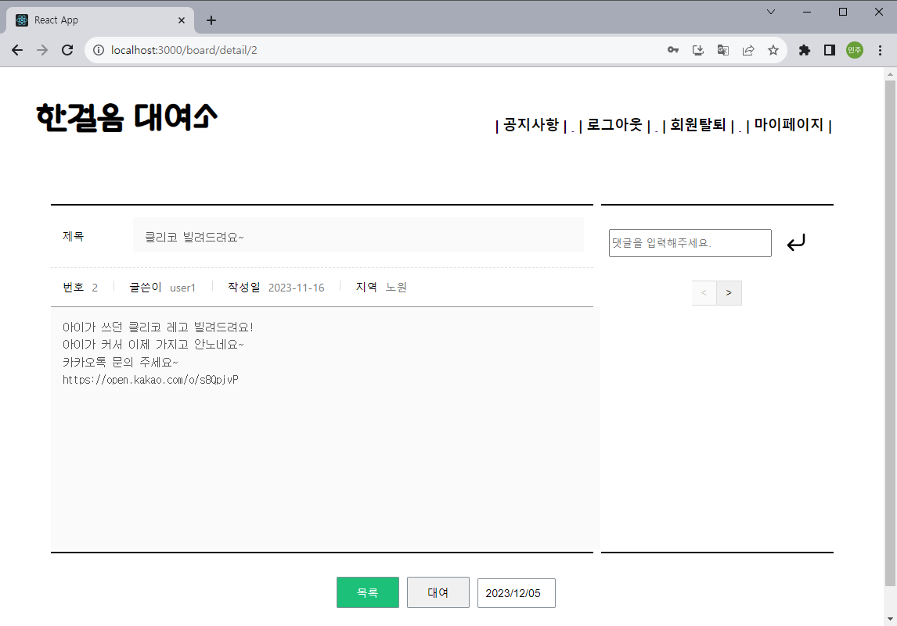
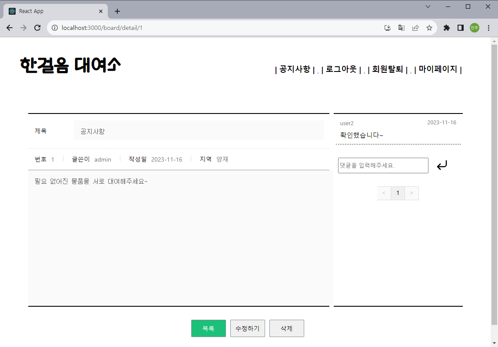

<h1 align="center">Welcome to FIRST STEP </h1>
<p>
</p>
<center>
    
</center>
<br>
> First Step / 한걸음 대여소 (신세계 I&C 2nd 모듈 프로젝트)

##### 🏠 [GitHub_Backend](https://github.com/Kwak-Minju/FIRSTSTEP_BE) 🏠 [GitHub_Front](https://github.com/Kwak-Minju/FIRSTSTEP_FE)


## ✨ Description
```sh
필요한 물폼 혹은 필요 없는 물품을 서로 공유하며 더 좋은 세상으로 한 걸음 나아가는 커뮤니티
```
## 🤼‍♂️Author
```sh
🐯 곽민주 : 마이페이지, 게시물 조회/수정/삭제, 게시물 대여/반납
🐉 조수아 : 데이터베이스, 게시판, 게시물 대여/반납, 로그인/로그아웃, 회원탈퇴, 비밀번호 변경
🐺 김기성 : 로그인
🐶 김서연 : 팀장, 회원가입
🐱 신명호 : 홈
```

## 🔍 기능
```sh
- 게시판 등록/수정/보기/삭제
- 로그인/로그아웃
- 회원가입/회원탈퇴
- 마이페이지(대여물품 조회, 비밀번호 변경)
- 게시물 대여/반납
```

## 🔧 기술 스택
### Front-end


### Backend
 
### Database


## 🏛️Architecture
<center>
        
</center>

## 🗃️DB
<center>
        
</center>

## 🏃 Steps to run

### 🗄️Backend

```bash
$ cd FIRSTSTEP_BE
$ python install -r requirements.txt
$ python server.py
```

### 💻Frontend 

```bash
$ cd FIRSTSTEP_FE
$ npm install
$ npm run
```
## 📌주요 코드

```python
# Flask / MySQL 연동
def getCon():
  return pymysql.connect(host="localhost",
                     user="root", password="1234",
                     db="firststep",
                     charset="utf8",
                     cursorclass=pymysql.cursors.DictCursor)

# axios를 통한 서버와의 비동기 통신
axios.put(`http://127.0.0.1:5000/boardEdit/${boardId}`, {title : title, content : content}, { headers: { 'Content-Type': 'application/json' } })
        .then(res => {
            setEdit(!edit);
            setBoardData(res.data)
        }).catch(err => console.log(err));
```

<br>

## 🔍 Overview
### 1. main 페이지
<center>
        
</center>

### 2. 공지사항 페이지
<center>
        
</center>

### 3. 로그인 페이지
<center>
        
</center>

### 4. 회원가입 페이지
<center>
        
</center>

### 5. 마이페이지
<center>
        
</center>

### 6. 상세 페이지
<center>
        
</center>
<center>
        
</center>
<br>